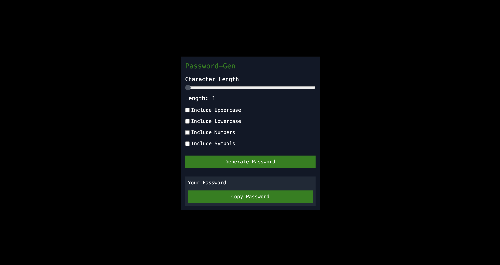

# Photos
Home Page                 
:-------------------------:


# EN - Password Generator App

This project is a password generator application where users can create random passwords with customizable character types.

## Features

- Generate passwords with customizable length
- Include uppercase, lowercase, numbers, and symbols
- Copy generated password to clipboard

## Installation

After cloning the project to your local environment, follow these steps to run it:

1. Clone the project:
    ```bash
    git clone https://github.com/kemalgundogdu/password-gen.git
    cd password-gen
    ```

2. Install the necessary dependencies:
    ```bash
    npm install
    ```

3. Start the application:
    ```bash
    npm start
    ```

## Technologies Used

- React
- Tailwind CSS

## Project Structure

- `src/`: Application source files
  - `App.js`: Main application component
  - `index.js`: Entry point of the application

## Contributing

If you would like to contribute, please send a pull request or open an issue.

## License

This project is licensed under the MIT License.

---

# TR - Şifre Oluşturucu Uygulaması

Bu proje, kullanıcıların özelleştirilebilir karakter türleriyle rastgele şifreler oluşturabileceği bir şifre oluşturucu uygulamasıdır.

## Özellikler

- Özelleştirilebilir uzunlukta şifreler oluşturma
- Büyük harfler, küçük harfler, sayılar ve semboller ekleme
- Oluşturulan şifreyi panoya kopyalama

## Kurulum

Projeyi yerel ortamınıza klonladıktan sonra aşağıdaki adımları izleyerek çalıştırabilirsiniz:

1. Projeyi klonlayın:
    ```bash
    git clone https://github.com/kemalgundogdu/password-gen.git
    cd password-gen
    ```

2. Gerekli bağımlılıkları yükleyin:
    ```bash
    npm install
    ```

3. Uygulamayı başlatın:
    ```bash
    npm start
    ```

## Kullanılan Teknolojiler

- React
- Tailwind CSS

## Proje Yapısı

- `src/`: Uygulama kaynak dosyaları
  - `App.js`: Ana uygulama bileşeni
  - `index.js`: Uygulamanın giriş noktası

## Katkıda Bulunma

Katkıda bulunmak isterseniz, lütfen bir pull request gönderin veya bir sorun (issue) açın.

## Lisans

Bu proje MIT Lisansı ile lisanslanmıştır.
